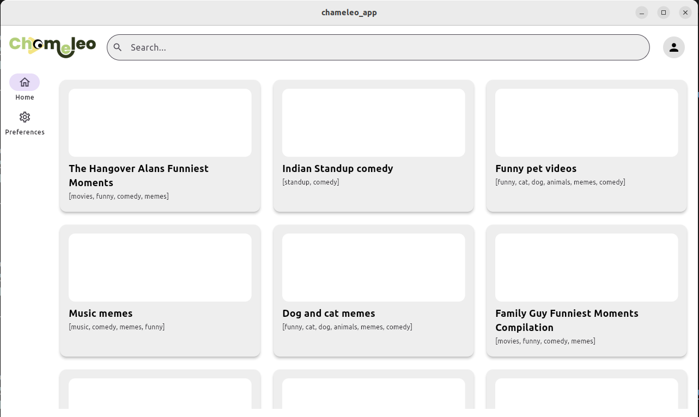
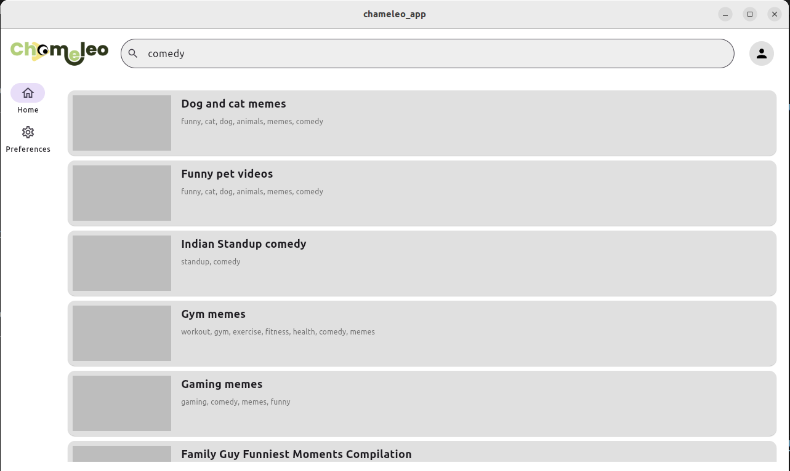
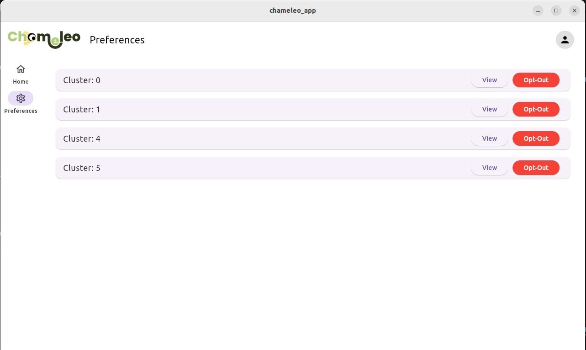
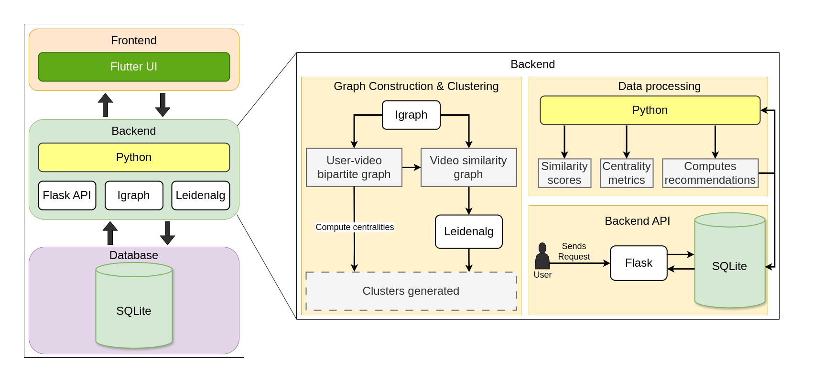
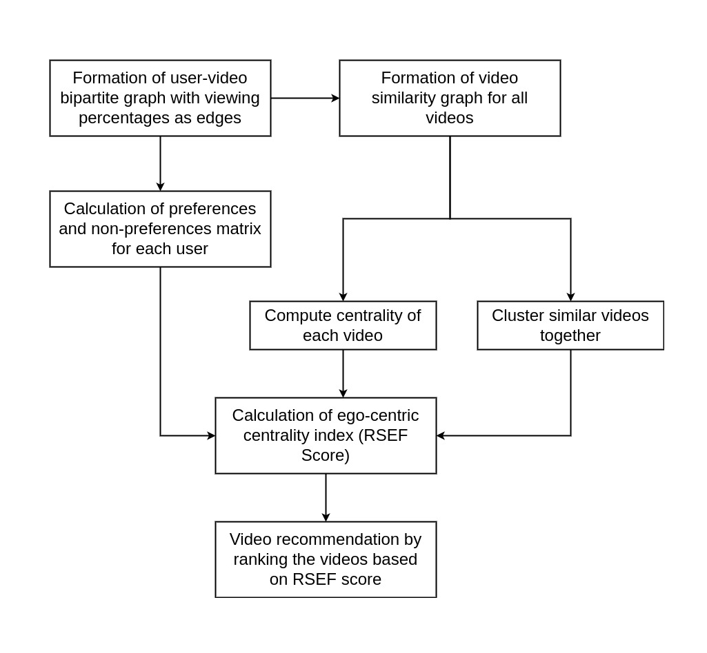

# 🦎 Chameleo: An Adaptive Recommendation System for Video-on-Demand (VOD) Platforms

## Demo

## Introduction

In the era of unprecedented digital content growth, particularly in Video-on-Demand (VOD) platforms, users are often overwhelmed by the sheer volume of choices. Effective recommendation systems are paramount for enhancing user experience, improving content discoverability, and boosting engagement. **Chameleo** is an innovative, adaptive recommendation system designed to address the challenges inherent in large-scale VOD environments, leveraging advanced graph-based methodologies and social network analysis.

---

## Problem Statement

The rapid expansion of digital content leads to critical issues in recommendation systems, primarily:
1.  **Data Sparsity:** Many users interact with only a tiny fraction of available content, leading to incomplete interaction data.
2.  **Cold Start Problem:** New users or new content lack sufficient interaction data for traditional collaborative filtering methods to provide accurate recommendations.
3.  **Lack of Control:** Users have limited ways to refine or adjust recommendations.

These challenges result in suboptimal recommendations, decreased user engagement, and missed opportunities for content discovery.

---

## Solution: Chameleo's Approach

Chameleo is a scalable and structured recommendation system that uses an ego-centric view of social networks to deliver more relevant and dynamic suggestions. It builds graphs from user-item interactions and video similarities, then applies centrality measures and community detection to group related content into clusters. Users can choose to opt out of specific clusters, giving them more control to adjust and improve their recommendations over time.

---

## Key Features

* **Graph-Based Modeling:**

  * **User-Item Interaction Graph:** Represents connections between users and the content they engage with.
  * **Video Similarity Graph:** Captures relationships between videos based on features or co-viewing behavior.
* **Advanced Centrality Measures:** Uses centrality metrics (e.g., Degree, Betweenness, Closeness) to identify key content in the network.
* **Modularity-Based Clustering:** Applies the **Leiden algorithm** for robust and efficient community detection, identifying strong content clusters.
* **Ego-Focused Centrality Index (CEF):** A custom metric that measures the importance of a user or video from an ego-centric perspective within its local graph.
* **Ego-Centric Recommendation Score (RSEF):** A unique scoring system that uses the CEF to generate personalized, context-aware recommendations.
* **Adaptive Recommendation Logic:** Dynamically updates recommendations based on changing user behavior and content patterns.
* **User-Controlled Clustering:** Allows users to opt out of specific content clusters, helping fine-tune their recommendation experience.

---

## Architecture Overview

Chameleo's architecture is centered around robust graph databases and analytical components. It involves:
1.  **Data Ingestion:** Processing VOD viewing logs and metadata.
2.  **Graph Construction:** Building dynamic user-item and video similarity graphs.
3.  **Graph Analysis Module:** Applying centrality measures and the Leiden algorithm.
4.  **Recommendation Engine:** Calculating CEF and RSEF scores to generate recommendations.
5.  **API/Integration Layer:** For seamless integration with VOD platforms.

---

## Data

Chameleo is designed to work with large-scale VOD platform data, specifically:
* User viewing history (e.g., `user_id`, `video_id`, `viewing_percentage`)
* Video metadata (e.g., `video_id`, `tags`, `title`)

---

## Results and Impact

Chameleo has been shown to effectively mitigate the challenges associated with data sparsity and the cold start problem in VOD recommendation systems. By providing highly relevant and adaptive content suggestions, the platform significantly enhances user engagement and content discovery, leading to a more satisfying and personalized viewing experience. Its scalable and structured framework ensures efficient performance even with ever-growing datasets.

---

## Contributing

We welcome contributions to Chameleo! If you have suggestions for improvements, new features, or bug fixes, please follow these steps:

1.  Fork the repository.
2.  Create a new branch (`git checkout -b feature/YourFeature`).
3.  Make your changes.
4.  Commit your changes (`git commit -m 'Add some feature'`).
5.  Push to the branch (`git push origin feature/YourFeature`).
6.  Create a new Pull Request.

Please ensure your code adheres to the project's coding standards.

---

## Acknowledgements

* We acknowledge the developers of the `networkx`, `pandas`, and `leidenalg` libraries for their invaluable tools.
* Special thanks to the research community for their foundational work in recommendation systems and graph theory. Project is based on [Network-Based Video Recommendation Using Viewing Patterns and Modularity Analysis: An Integrated Framework][ref1].

[ref1]: https://ieeexplore.ieee.org/document/10830490

---
## Co-creators

- [Mohammed Favas](https://github.com/favasmhd)
- [Muhammed Sinan P K](https://github.com/sinaaannh)
- [Muhammed Midlaj V](https://github.com/Muhammedmidlaj786)
